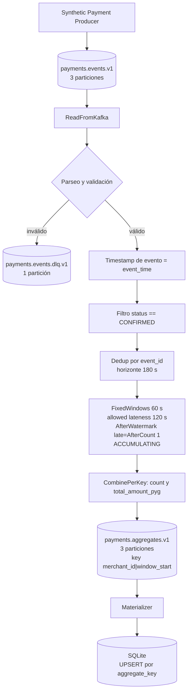

# Monitoreo de pagos en streaming

Pipeline de streaming que calcula, por comercio y por minuto, la cantidad y el
monto de transacciones en estado `CONFIRMED`. Los eventos sintéticos de pago se
procesan con Apache Beam sobre tiempo de evento. El pipeline descarta
duplicados por `event_id` y tolera eventos que llegan fuera de orden o
atrasados. El resultado se publica en Kafka y se materializa en SQLite.

## Arquitectura



El producer publica eventos en `payments.events.v1`. El pipeline Beam los lee
con KafkaIO y separa los que no cumplen el contrato hacia
`payments.events.dlq.v1`. Cada evento válido toma su timestamp del campo
`event_time`. Después del filtro por `status == CONFIRMED` viene la
deduplicación por `event_id`, y luego el agrupamiento en ventanas fijas de 60
segundos por `merchant_id`. Cada ventana produce un agregado con
`transaction_count` y `total_amount_pyg` que se publica en
`payments.aggregates.v1`. El materializer consume ese topic y aplica un UPSERT
sobre SQLite con `merchant_id|window_start` como clave.

## Requisitos

- Docker Desktop / Docker Compose
- Python 3.12
- uv
- Java 11 o superior, para el expansion service cross-language de KafkaIO. El
  proyecto se verificó con OpenJDK 17. No hace falta cambiar `JAVA_HOME` de
  forma persistente: en PowerShell se puede definir en la sesión de terminal
  donde se ejecuta Beam (ver más abajo).

Solo Kafka corre en Docker. El producer, el pipeline Beam y el materializer se
ejecutan en el host.

## Instalación

```
uv sync
```

## Kafka

```
docker compose up -d
docker wait kafka-init
```

El servicio `kafka-init` crea los tres topics y termina. `docker wait
kafka-init` devuelve `0` cuando la creación terminó. Para verificar:

```
docker exec kafka kafka-topics --bootstrap-server localhost:29092 --list
docker exec kafka kafka-topics --bootstrap-server localhost:29092 --describe --topic payments.events.v1
```

| Topic | Particiones | Key | Contenido |
|---|---|---|---|
| `payments.events.v1` | 3 | `merchant_id` | eventos de pago de entrada |
| `payments.aggregates.v1` | 3 | `merchant_id\|window_start` | agregados por comercio y ventana |
| `payments.events.dlq.v1` | 1 | `event_id` si existe, si no vacía | eventos que no pasan validación |

La dirección de Kafka se resuelve como flag `--bootstrap-servers`, luego la
variable `KAFKA_BOOTSTRAP_SERVERS`, luego el default `localhost:9092`. Los
procesos del host usan `localhost:9092`. Un proceso dentro de la red de
`docker-compose` usaría `kafka:29092`.

## Contrato de entrada

```json
{
  "schema_version": 1,
  "event_id": "6cecc258-1bfa-430d-9d68-5155e98cd7d9",
  "key": "merchant-003",
  "event_time": "2026-01-01T12:00:04.000Z",
  "payload": {
    "transaction_id": "txn-dd23f7b6a801cf8b",
    "merchant_id": "merchant-003",
    "account_id": "account-004",
    "amount": 400264,
    "currency": "PYG",
    "status": "CONFIRMED"
  }
}
```

- `schema_version` debe ser `1`.
- `event_id` identifica el evento y es lo que usa la deduplicación.
- `key` es la key Kafka del evento y debe coincidir con `payload.merchant_id`.
- `event_time` es ISO 8601 con zona horaria. Define en qué ventana cae el
  evento.
- `payload.amount` es un entero en guaraníes. `payload.currency` debe ser
  `"PYG"`.
- `payload.status` es `CONFIRMED`, `DECLINED` o `PENDING`. El pipeline agrega
  solo los `CONFIRMED`.

Las reglas completas de validación están en `docs/technical.md`.

## Ejecución del demo

Los comandos asumen que ejecutás desde la raíz del repo. Empezá desde un
entorno limpio para que los topics arranquen en offset 0.

```
docker compose down -v --remove-orphans
docker compose up -d
docker wait kafka-init
```

### Producer

```
uv run python -m streaming_payments.producer.producer --scenario demo --start-now
```

El escenario `demo` publica 10 eventos: seis normales, uno fuera de orden, uno
duplicado (repite el `event_id` de otro), uno tardío (`event_time` muy
anterior) y uno inválido (sin `event_id`). Con `--start-now` los `event_time`
se anclan al momento de ejecución en lugar de una fecha fija.

Para inspeccionar los eventos sin publicar nada:

```
uv run python -m streaming_payments.producer.producer --scenario demo --dry-run
```

### Pipeline Beam

KafkaIO necesita Java 11 o superior. Si `JAVA_HOME` del sistema apunta a otra
versión, se puede definir de forma temporal en la terminal donde se corre Beam.

En PowerShell, en la sesión de terminal donde vas a correr Beam:

```
$env:JAVA_HOME = "C:\ruta\a\un\jdk-17"
```

Esa asignación vale solo para esa sesión de PowerShell. Al cerrar la terminal,
la configuración persistente queda como estaba.

```
uv run python -m streaming_payments.pipeline.kafka_pipeline `
  --bootstrap-servers localhost:9092 `
  --input-topic payments.events.v1 `
  --aggregates-topic payments.aggregates.v1 `
  --dlq-topic payments.events.dlq.v1 `
  --max-num-records 10
```

En bash el equivalente define `JAVA_HOME` solo para ese comando:

```
JAVA_HOME=/ruta/a/un/jdk-17 uv run python -m streaming_payments.pipeline.kafka_pipeline \
  --bootstrap-servers localhost:9092 \
  --input-topic payments.events.v1 \
  --aggregates-topic payments.aggregates.v1 \
  --dlq-topic payments.events.dlq.v1 \
  --max-num-records 10
```

`--max-num-records 10` acota la lectura para el demo. Sin ese flag la lectura
de Kafka es unbounded. Ver [Limitaciones](#limitaciones).

### Contar los agregados producidos

El materializer necesita saber cuántos registros leer.

```
docker exec kafka kafka-run-class kafka.tools.GetOffsetShell \
  --broker-list localhost:29092 --topic payments.aggregates.v1 --time -1
```

El comando imprime una línea `topic:particion:offset` por partición. En el demo
limpio los topics se recrearon con `docker compose down -v`, así que arrancan
en offset 0 y la suma de esos offsets es la cantidad de agregados producidos.
Sumá los offsets y reemplazá `N` por ese entero en el comando siguiente. La
cantidad depende de cómo caen los eventos en las ventanas, así que puede
cambiar entre corridas de `--start-now`.

Esto vale como conteo directo solo en el demo limpio, con los topics creados
desde offset 0. En un topic con historial esa suma no representa los mensajes
pendientes de un consumer group.

### Materializer

```
uv run python -m streaming_payments.materializer.materializer \
  --bootstrap-servers localhost:9092 \
  --topic payments.aggregates.v1 \
  --db-path data/materialized.db \
  --max-messages N
```

### Consultar el resultado

```
uv run python -c "import sqlite3; print(*sqlite3.connect('data/materialized.db').execute('SELECT aggregate_key, merchant_id, transaction_count, total_amount_pyg FROM merchant_window_aggregates ORDER BY aggregate_key').fetchall(), sep=chr(10))"
```

Usa solo la librería estándar. El `SELECT` es
`SELECT aggregate_key, merchant_id, transaction_count, total_amount_pyg FROM
merchant_window_aggregates ORDER BY aggregate_key`.

## Tests

```
uv run pytest -q
uv run ruff check src tests
```

Resultado verificado: `110 passed` y `All checks passed!`.

## Detener

```
docker compose down                     # detiene los contenedores
docker compose down -v --remove-orphans # además borra el volumen de Kafka
```

## Tiempo, dedup e idempotencia

Cada evento se ubica en el tiempo por su `event_time`, no por la hora de
llegada. El pipeline agrupa los pagos `CONFIRMED` por `merchant_id` en ventanas
fijas y espera hasta 120 segundos a que lleguen eventos de una ventana ya
cerrada. El trigger emite un pane cuando el watermark pasa el fin de la
ventana. Después emite un pane más por cada evento tardío que entra dentro de
ese margen. Con modo `ACCUMULATING` cada pane trae el acumulado de la ventana
hasta ese momento; Beam no modifica el pane anterior, emite una versión nueva.

    ventana            = 60 s
    allowed lateness   = 120 s
    trigger            = AfterWatermark(late=AfterCount(1))
    modo               = ACCUMULATING
    horizonte de dedup = 180 s

La deduplicación descarta un `event_id` ya visto y mantiene ese estado durante
180 segundos, que es `WINDOW_SIZE_SECONDS + ALLOWED_LATENESS_SECONDS`. Todos
los panes de una misma ventana salen con la misma `aggregate_key`,
`merchant_id|window_start`. El materializer recibe esas versiones sucesivas y
su `INSERT ... ON CONFLICT DO UPDATE` deja en SQLite la última. El detalle está
en `docs/technical.md`.

## Semántica

La entrega es at-least-once con sink idempotente por UPSERT. No es
exactly-once. Kafka puede reentregar un registro. El pipeline puede emitir
varios panes para la misma ventana. No hay una transacción que cubra a la vez
el commit de Kafka y la escritura en SQLite. El materializer escribe el
agregado en SQLite antes de confirmar el offset en Kafka. Si el proceso falla
entre esos dos pasos, Kafka reenvía el mensaje y el UPSERT sobre la misma
`aggregate_key` deja el mismo estado. La idempotencia viene de que la
`aggregate_key` es estable y el UPSERT deja siempre la última versión de esa
ventana.

## DLQ

Un evento que no se puede parsear (UTF-8 o JSON inválido) o que no cumple el
contrato se manda a `payments.events.dlq.v1`. El valor es un JSON con
`raw_data` (el evento como llegó) y `errors` (la lista de motivos). La key es
el `event_id` si el evento lo tenía, si no queda vacía.

## Limitaciones

- Sin `--max-num-records`, la lectura de Kafka del pipeline es unbounded. El
  flag acota la lectura para hacer un smoke o la prueba E2E (end-to-end) local
  de forma reproducible.
- Con DirectRunner y KafkaIO cross-language en este entorno, `WriteToKafka` no
  materializaba las escrituras mientras la fuente seguía unbounded. Acotar la
  lectura lo resuelve. Fue una limitación observada en este entorno y no una
  regla general de Beam.
- La corrida bounded del E2E prueba que los componentes se integran, no el
  comportamiento exacto de allowed lateness. Esa semántica se prueba con
  TestStream en `tests/test_late_events.py`.
- Kafka está containerizado. El producer, Beam y el materializer corren en el
  host.

## Evidencia

- `evidence/block-02-kafkaio/`: smoke de KafkaIO real (lectura de Kafka,
  escritura de agregados y DLQ).
- `evidence/block-03-materializer/`: materializer, sus 23 tests y el smoke de
  idempotencia (3 mensajes, 2 filas).
- `evidence/block-04-e2e/`: prueba E2E con reconciliación entre SQLite y el
  último agregado por clave.
- `tests/test_late_events.py` y `tests/test_out_of_order.py`: semántica
  temporal con TestStream.

## Entregables

- Presentación: `presentacion-proyecto-final-streaming.pdf`, en la raíz del
  repo.
- Video de demo: `demo-proyecto-final-streaming.mp4`, en la raíz del repo.

## Estructura

```
src/streaming_payments/
  common/         config.py (constantes), contracts.py (schemas)
  producer/       productor sintético
  pipeline/       pipeline.py (transforms Beam), kafka_pipeline.py (KafkaIO)
  materializer/   consumidor idempotente a SQLite
tests/            110 tests (pytest, TestStream, sin broker)
docs/             technical.md
evidence/         salidas de los smokes y del E2E
docker-compose.yml
Makefile          atajos opcionales: up, down, logs, topics, test, lint, clean
presentacion-proyecto-final-streaming.pdf
demo-proyecto-final-streaming.mp4
```

El `Makefile` es un atajo para quien tenga GNU Make instalado. No es un
requisito. Todos los pasos funcionan con `docker compose` y `uv` directamente.
